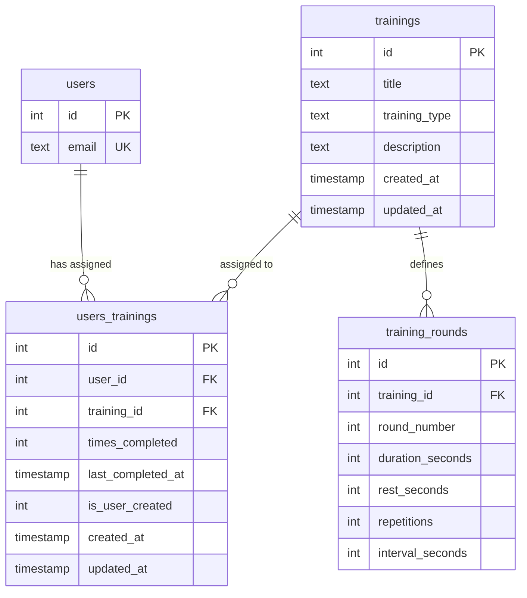

# Database schema

Ring Training App uses **SQLite** via `better-sqlite3`. The canonical schema lives in [`src/mocks/DB_SCHEMA.sqlite.sql`](../src/mocks/DB_SCHEMA.sqlite.sql) and is applied at runtime by [`src/lib/db.ts`](../src/lib/db.ts) and by scripts via [`scripts/db-utils.mjs`](../scripts/db-utils.mjs).

## Why normalize?

Before the refactor, each seed inserted **one `trainings` row per user** with identical `title`, `description`, and rounds. With 3 MVP users and 5 routines, the database held ~15 trainings and ~15 rounds instead of 5 and 5.

The normalized model separates:

- **Catalog** (`trainings` + `training_rounds`) — shared routine definitions
- **Assignments** (`users_trainings`) — which user has which routine, plus per-user progress

## Entity relationship



## Tables

### `users`

Authorized MVP accounts. Created via `pnpm db:seed-users` (no public sign-up).

### `sessions`

Lucia auth sessions. Managed by `@lucia-auth/adapter-sqlite`.

### `trainings` (catalog)

Shared routine definitions. **No `user_id`.** Uniqueness is enforced on `(title, training_type)` so the same name can exist with different routine types.

| Column | Notes |
|--------|-------|
| `title` | Routine name (e.g. `Light spar`) |
| `training_type` | One of `HIIT`, `HIIT_EXTENDED`, `SPARRING_2`, `SPARRING_3` |
| `description` | Short description shown in the UI |

Removed from this table (moved to `users_trainings`): `user_id`, `times_completed`, `last_completed_at`.

### `users_trainings` (assignments)

Many-to-many link between users and catalog routines, with per-user progress.

| Column | Notes |
|--------|-------|
| `user_id` | FK → `users(id)` |
| `training_id` | FK → `trainings(id)` |
| `times_completed` | How many times this user completed the routine (default 0) |
| `last_completed_at` | Last completion timestamp for this user |
| `is_user_created` | `1` when the assignment came from the create-routine flow, `0` for seeded routines |

`UNIQUE (user_id, training_id)` prevents duplicate assignments.

**Creation quota:** a user can hold at most `MAX_USER_CREATED_ROUTINES` (5) assignments with `is_user_created = 1`, enforced server-side in `createRoutineAction`. Seeded routines are free because they keep `is_user_created = 0`. Deleting a routine removes the row and frees the slot.

**Delete behavior:** When a user removes a routine from their list (InfoCard delete), the `users_trainings` row is removed. If that was the **last** assignment for the routine, the catalog entry and its `training_rounds` are deleted in the same transaction, so the catalog cannot accumulate orphan rows through repeated create/delete cycles. While any other user still has the routine assigned, the catalog entry is preserved.

Seeded routines follow the same rule: if every user removes one, it disappears from the catalog and comes back by re-running the corresponding seed (`pnpm db:seed-all`), which is idempotent.

### `training_rounds`

Round configuration for a catalog training. One or more rows per `training_id`.

## Before vs after (MVP seeds)

| Metric | Legacy schema | Normalized schema |
|--------|---------------|-------------------|
| `trainings` rows (5 routines × 3 users) | ~15 | **5** |
| `training_rounds` rows | ~15 | **5** |
| `users_trainings` rows | 0 (N/A) | **15** (5 × 3 users) |

Each user still sees 5 routines in `/training`; they now share the same `training_id` for identical titles.

## Migration from legacy schema

If an existing database has `trainings.user_id`, the app and scripts detect the legacy schema and:

1. `DROP` `training_rounds` and `trainings`
2. Recreate tables with the normalized schema
3. Preserve `users` and `sessions`

**Data in old trainings/rounds is not migrated** — re-seed after migration:

```bash
pnpm db:migrate-normalize   # optional explicit step (also runs on app startup)
pnpm db:migrate-training-type
pnpm db:seed-all
pnpm db:status
```

On Railway after deploy:

```bash
railway ssh -- node scripts/migrate-normalize-db.mjs
railway ssh -- node scripts/seed-all.mjs
railway ssh -- node scripts/db-status.mjs
```

## Application queries

| Operation | Entry point | SQL path |
|-----------|-------------|----------|
| List user's routines | `getAllTrainingsByUserId` | `users_trainings` → `trainings` → `training_rounds` |
| Routine detail | `getTrainingByIdForUser` | `users_trainings` → `trainings` → `training_rounds` (scoped to user) |
| Create routine | `createRoutineAction` | Insert or link catalog entry + assign to user |
| Remove from list | `unlinkTrainingFromUser` | `DELETE FROM users_trainings WHERE user_id = ? AND training_id = ?` |

The UI type [`Training`](../src/types/Trainings.ts) is unchanged (flattened join shape).

## Seeds (two phases)

1. **Catalog:** `INSERT INTO trainings` + `training_rounds` (once per routine title)
2. **Assignment:** `INSERT OR IGNORE INTO users_trainings` for MVP emails

See [`DB_SEED_trainings.sqlite.sql`](../src/mocks/DB_SEED_trainings.sqlite.sql) and related HIIT seed files.

## Orphan cleanup

A catalog training with **no** `users_trainings` rows is considered orphaned and can be removed with:

```bash
pnpm db:cleanup-orphan-trainings
```

Broken assignment rows (invalid `user_id` or `training_id`) are also removed.

## Related docs

- [scripts.md](./scripts.md) — CLI commands and workflows
- [railway-deployment.md](./railway-deployment.md) — production deploy and reseed
